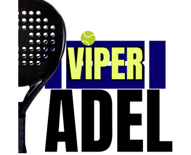

<h1 align="center" id="title">Padel Viper </h1>
<p align="center"></p>

<p id="description" align="center">Proyecto basado en un sistema de reservas de pistas de pádel de forma rápida y sencilla, mostrando todo de una forma clara y pudiendo ver en todo momento la disponibilidad que mejor te conviene.</p>

## 🚀 Web de producción
<p align="center">
  
</p>


## 💻 Tecnologias usadas
Gestion por APIs del backend y UI completa en Next:

*   [Laravel](https://laravel.com/)
*   [TailwindCSS](https://tailwindcss.com/)
*   [React](https://de.react.dev/)
*   [Next.Js](https://nextjs.org/)
*   TypeScript
*   PHP
*   Git 
## 🛠️ Instalación Local del Proyecto

*Antes de realizar la guia de instalcion recordar que es necesario disponer de una version de Node 20.12.2 o > 
y una versión de PHP 8.3.6, para garantizar la correcta ejecucion de la web.*

#### Creación

<p>1. Clona el repo</p>

```
git clone https://github.com/DAW-presencial/proyecto23-24-moha-02.git
```
Una vez clonado disponemos de dos carpetas __Backend__ y __FrontEnd__ 
<p style="color:gray; font-size:smaller; font-style:italic;">
  *(recomendamos abrir una terminal para cada una)*
</p>
<p>2. Instalacion Backend</p>

```
composer update 
```

```
composer install 
```
<p>3. Creacion .env Back</p>

```
touch .env
```
<p style="color:gray; font-size:smaller; font-style:italic;">
  Has de configurar los parametros basicos para que el backend se ejecute "DB_DATABASE, DB_USERNAME, DB_PASSWORD..."
</p>
<p>4. Instalacion UI Frontend</p>

```
npm install 
```
<p style="color:gray; font-size:smaller; font-style:italic;">
  Verificar la correcta creación de node_modules
</p>
<p>5. Creacion .env Front</p>

```
touch .env
```
<p style="color:gray; font-size:smaller; font-style:italic;">
  Has de configurar los parametros basicos para que el front reciba los datos del back "NEXT_PUBLIC_API_URL, NEXT_PUBLIC_URL_BACKEND."
</p>

#### Ejecucción

<p>1. Ejecutar back</p>

``` 
php artisan serve 
```

<p>2. Ejecutar front</p>

``` 
npm run dev
```
## 🧐 Explicación Funcionalidades


  
